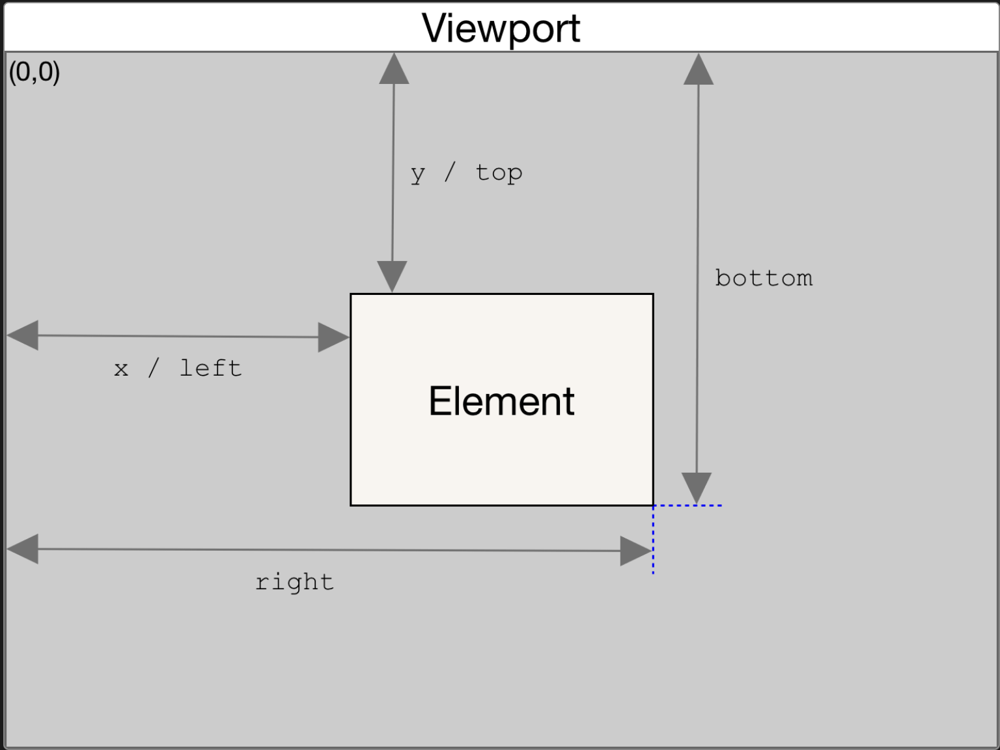

# Cool Hover Effect

> This is a GitHub project that showcases a cool hover effect that was inspired by the Hyperplexed YouTube channel. The project provides a step-by-step guide on how to create the effect, and it also includes a tutorial video link.

## Introduction

The cool hover effect is created using JavaScript and CSS, and it provides an interactive and visually impressive user experience. The project was inspired by the Hyperplexed YouTube channel, and it was first coded along with the tutorial video. After following the tutorial, the project was recreated independently to reinforce the concepts learned.

## Tutorial

The tutorial video link for this project can be found [here](https://www.youtube.com/watch?v=htGfnF1zN4g&t=140s&ab_channel=Hyperplexed): The video provides a detailed guide on how to create the cool hover effect. This is the website like for the effect from which youtuber was inspired. Click [here](https://linear.app/features)

## Learning Outcomes

This project is small but educational, and it provides a great opportunity to learn about manipulating CSS properties and using JavaScript to create visually impressive effects on web pages. By following the tutorial and recreating the project, I learned a lot about `getBoundingClientRect()`, `MouseEvent clientX` Property, how to get the position of the mouse within any specific element, and some really slick tricks to create dynamic borders.

## Recommendations

I would highly recommend others to explore this project to gain a better understanding of how to create visually impressive effects on web pages. The effect can be viewed by clicking on the provided link in this readme file.

## Future Plans

This awesome trick can be used to create other visually impressive effects on web pages, and I plan to utilize it in future projects to enhance the visual experience.

> In summary, this GitHub project showcases a cool hover effect that was inspired by the Hyperplexed YouTube channel. The project is small but educational, and it provides a great learning opportunity for those who want to learn more about manipulating CSS properties and using JavaScript to create visually impressive effects on web pages.
